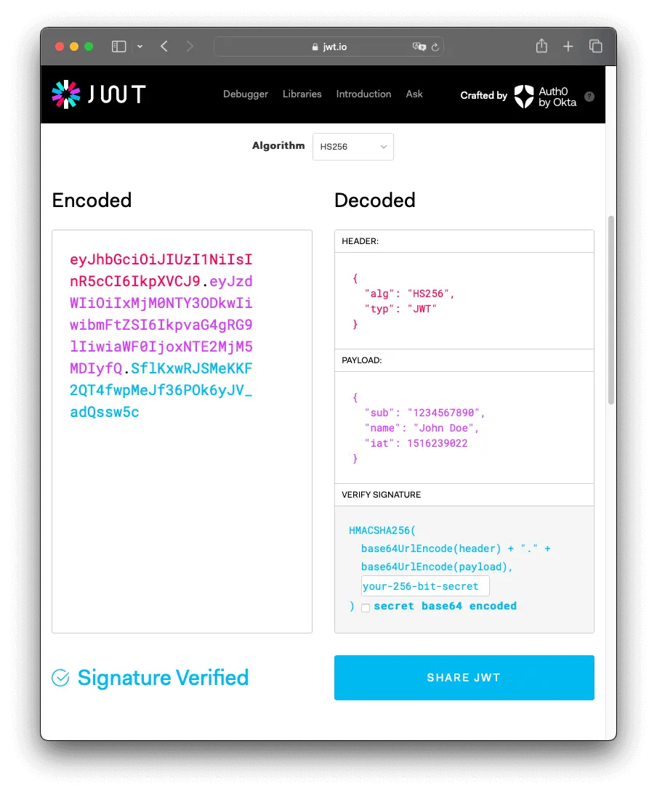

# Tutorial

Every other website that deals with user information will has a login system. Although simple, building will teach you how to write backend apis, connect those apis to frontend and create isloated components that can be easily debuged. All in all, a good starter practice. 

I will not include how to install and set up different environment and start with the code. 

> Note : Ensure your json files have same module system. Ex - ESM or CommonJS

> Note : If you know Javascript, Typescript comes easier. Type related errors in JS is handled during runtime while TS handles them during compile time. 


## Backend

We need a server and a database for our backend to be complete. For my case, I use express in Typescript and PostgreSQL. 

Imagine this, you are a customer at a resturant. Let's say there are multiple chefs for different cuisines. Your main goal is to get some food. Waiter gets your order. The kitchen assigns the dish to a chef. Chef prepares it and you are served the food. If you understand this, I'm happy to say you understand how backend works.

Putting this into technical terms, frontend sends request (customer orders). The request passes through some middleware(cuisine identification and chef assignment), then it is routed (goes to the chef). The API (chef) prepares a response (food) and sends it back to you. 

We need 4 things for a complete API endpoint. Let's dicuss them: 

### Clients


```js
const prisma = new PrismaClient();
const router = express.Router();
const client = new OAuth2Client(process.env.GOOGLE_CLIENT_ID);
```

You need some agents or workers to be the point of contact, somebody to talk with the respective departments. These departments are the database, your backend server and google OAuth.

### Schema

```js
const loginSchema = Joi.object({
    username : Joi.string().required(),
    password : Joi.string().required(),
});
```

Ever been to a bank? Fill the form haunts everyone. It shall haunt you here as well(and your users). Ensuring that your data follows a schema helps you follow a strict rule. This rule helps reduce errors and future-proof your work against your bad memory.

Joi is just a helper tool makes it easier to validate the type. You can do this kind of magic with it.

```typescript
    username: Joi.string().alphanum().min(3).max(30).required()
```

<div style="max-height:400px; overflow-y:auto; margin-bottom:20px">

<!-- ```js
router.post("/login", async (req : Request, res: Response) => {
    try {
        const {error, value} = loginSchema.validate(req.body);
        if (error) {
            return res.status(400).json({error : error.message || "Invalid Credentials in schema"});
        }

        const {username, password} = value;

        const user = await prisma.user.findFirst({
            where : {
                OR : [{username}, {email : username}],
            },
        });

        if (!user) {
            return res.status(401).json({error : "Invalid username/email"});
        }
        if (!user.passwordHash) {
            return res.status(500).json({error : "User had signed in using Google login earlier."})
        }
        const isValid = await bcrypt.compare(password, user.passwordHash);
        if (!isValid) {
            return res.status(401).json({error : "Invalid Password"});
        }

        const token = jwt.sign(
            {userId : user.id},
            process.env.JWT_SECRET!,
            {expiresIn : "1h"}
        );

        const session = await prisma.session.create({
            data : {
                userId : user.id,
                token,
                expiresAt : new Date(Date.now() + 1000*60*60),
                createdAt : new Date(Date.now()),
            }
        });

        const {passwordHash, ...safeUser} = user;

        return res.json({
            message : "Login Successful",
            token,
            user : safeUser,
            sessionId : session.id,
        });
    } catch(err) {
        console.error(err);
        return res.status(500).json({error : "Internal server error"});
    }
});


``` -->
</div>

### Action and Path

```router.post("/path", do something);``` 

This tells the server whenever frontend calls here - *do something*. Sometimes, before doing something you might want to do *that*. We can do *that* by -

```router.post("/path", do that, then do something)```

One more technical detail to not is we are using ```POST```. Whenever we want to send data to the server we use ```POST```. Other cases include ```GET```, ```UPDATE``` or ```DELETE```. 

### Logic 

We have our 3 essential things now. Clients who can talk to various departments(services). Schemas for validation. The path using which the frontend can contact. Now, we can define the *do something* part. 

For a login system, the something looks like:


1. Request is received as a paramter. This would be a good time to discuss what data from frontend looks like. We have a header and a body (just like HTML). Header defines what kind of data is in body and it may also contain some easter eggs like ```token```.

    ```json
    Content-Type: application/json
    Authorization: Bearer myPrecious

    {
    "name": "DJ",
    "age": 22,
    }
    ```
2. Schema Validation
    ```typescript
    const {error, value} = loginSchema.validate
    ```
    Value contains the in the form as declared in the schema.
3. Checking for exisiting user
    ```TS
    const user = await prisma.user.findFirst({
                where : {
                    OR : [{username}, 
                    {email : username}],
                },
        );

    if (!user) {
        return res.status(401).json({error : "Invalid username/email"});
     }
    ```
    We use the database agent to find using username or email. The logic in frontend allows user to enter either username or email to login. ```{email : username}``` ensures the search works in either case. If the user doesn't exist, the login process wraps up.

    ```res``` is the ```Response``` object that can be used to send a *response* to the frontend. Status codes have been standardized. You can look them up [here](https://status.js.org/). 

4. As we are dealing with login, there is a password coupled with a username. Password is stored in the form hash to prevent damages to user in case of a password leak. 
Passwords are hashed during registration using
```const hashedPassword = await bcrypt.hash(password,10);```. 
    ```typescript
    const isValid = await bcrypt.compare(password, user.passwordHash);
    if (!isValid) {
        return res.status(401).json({error : "Invalid Password"});
    }
    ```

5. Next we create token. Token is kind of an entry key to various resources that your website has to offer. To ensure no one can re-create the same token, we keep a secret key with us. You can give it some payload like user information and other metadata. 

             

    *Image taken from [here](https://www.jwt.io/introduction#what-is-json-web-token-structure)*

    As you can see, the Jwt based signature uses SHA256 type encryption. To brute force and decode this token you would need [10 trillion years](https://youtu.be/S9JGmA5_unY?si=Ay_U_SfTB0e2a8_I).

    ```TS
    const token = jwt.sign(
            {userId : user.id},
            process.env.JWT_SECRET!,
            {expiresIn : "1h"}
        );

        const session = await prisma.session.create({
            data : {
                userId : user.id,
                token,
                expiresAt : new Date(Date.now() + 1000*60*60),
                createdAt : new Date(Date.now()),
            }
        });
    ```
    You can create a JWT secret key by running this. 
    ```
    node -e "console.log(require('crypto').randomBytes(64).toString('hex'))" 
    ``` 
6. We send our response using ```res```
    ```TS
    const {passwordHash, ...safeUser} = user;

        return res.json({
            message : "Login Successful",
            token,
            user : safeUser,
            sessionId : session.id,
        });
    ```


> Note : Route parameters and query paramters are essential for other use cases, especially GET.

Now, we have a complete login API endpoint which could be hit using a frontend request. Look at the whole code [here](./backend/src/routes/authRoutes.ts).


