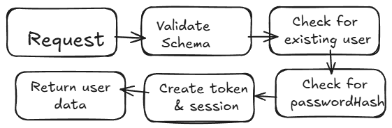

# Tutorial

Every other website that deals with user information will has a login system. Although simple, building will teach you how to write backend apis, connect those apis to frontend and create isloated components that can be easily debuged. All in all, a good starter practice. 

I will not include how to install and set up different environment and start with the code. 

> Note : Ensure your json files have same module system. Ex - ESM or CommonJS

> Note : If you are using any Classes during runtime, you have to make your intent known by using 'type' keyword in TypeScript.


## Backend

We need a server and a database for our backend to be complete. For my case, I use express in Typescript and PostgreSQL. 

Imagine this, you are a customer at a resturant. Let's say there are multiple chefs for different cuisines. Your main goal is to get some food. Waiter gets your order. According to the cuisine, he takes the order to the chef. Chef prepares it and you are served the food. If you understand this, I'm happy to say you understand how backend works.

Putting into technical terms, frontend sends request (customer orders). The request passes through some middleware(cuisine identification and validation), then it is routed (goes to the chef). The API (chef) prepares a response (food) and sends it back to you. 

Let's start with the API endpoints, then we will string it back togther. 

#### Creating *authRoutes.ts*

We declare different clients to deal with different functionality. Prisma client helps to deal with database queries. We need a router client to route different APIs to different path. Lastly, we need a OAuth client to deal with Google login.

```js
const prisma = new PrismaClient();
const router = express.Router();
const client = new OAuth2Client(process.env.GOOGLE_CLIENT_ID);
```

We will define schemas now, so that the data that the frontend sends is in accordance with the database schema. 

```js
const loginSchema = Joi.object({
    username : Joi.string().required(),
    password : Joi.string().required(),
});
```

I will explain the *login* logic. The same can be extended to others with some modification.

<div style="max-height:400px; overflow-y:auto">

```js
router.post("/login", async (req : Request, res: Response) => {
    try {
        const {error, value} = loginSchema.validate(req.body);
        if (error) {
            return res.status(400).json({error : error.message || "Invalid Credentials in schema"});
        }

        const {username, password} = value;

        const user = await prisma.user.findFirst({
            where : {
                OR : [{username}, {email : username}],
            },
        });

        if (!user) {
            return res.status(401).json({error : "Invalid username/email"});
        }
        if (!user.passwordHash) {
            return res.status(500).json({error : "User had signed in using Google login earlier."})
        }
        const isValid = await bcrypt.compare(password, user.passwordHash);
        if (!isValid) {
            return res.status(401).json({error : "Invalid Password"});
        }

        const token = jwt.sign(
            {userId : user.id},
            process.env.JWT_SECRET!,
            {expiresIn : "1h"}
        );

        const session = await prisma.session.create({
            data : {
                userId : user.id,
                token,
                expiresAt : new Date(Date.now() + 1000*60*60),
                createdAt : new Date(Date.now()),
            }
        });

        const {passwordHash, ...safeUser} = user;

        return res.json({
            message : "Login Successful",
            token,
            user : safeUser,
            sessionId : session.id,
        });
    } catch(err) {
        console.error(err);
        return res.status(500).json({error : "Internal server error"});
    }
});


```
</div>

The router variable takes in creates a path. Whenever frontend tries to contact this route, it sends 2 objects - a request and a response object. Request is what we will work with and Response object will be used to send back any data back to the frontend again. 

It is to be noted that there are multiple conditions that we check to make our APIs error-prune. 




