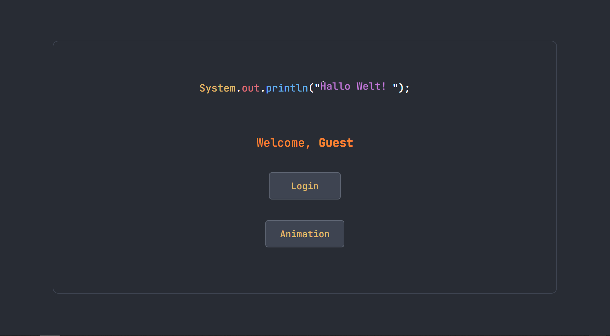

# auth-login

A web based application that implements registration, login and google sign in Typecscript + React and PostgreSQL. 

Use this as a base to build your application. No need to create login authentication system from scratch. Or. Treat this as a tutorial to understand what goes on when creating a login authentication system.



## Features

1. Contains login, google login, registration pipelines.
2. Contains implementation of Routing and Navigation and a Protected Route.
4. Jwt-signed authentication.
5. Auto login enabled after Registration.
6. Isolated components and APIs. Easier to tweak. 

Find the complete tutorial [here](/Doc.md) on how to build a complete login system end to end.


## Steps for Set-up

#### Dependencies

- Npm : v10.9.0 or higher
- Node : v22.18.0 or higher

#### Setting up google cloud
1. Create a project for web-based application
2. Enable OAuth2.
3. Get Google Client ID. 
4. Put the url of your vite application in Javascript Origin and Redirect URLs. 


Fill up ```.env``` files. Make sure to uncomment the ```.env``` in ```.gitignore```


#### Setting up PostgreSQL Database

Create a PostgreSQL database and get the database link and update the ```.env```. 

Run the commands to push the schema.
```code
npx prisma generate
npx prisma db push
```

If you want to test apis in Postman, use this [playground](https://developers.google.com/oauthplayground/) for getting token for Google Login. 

You are all set up!!

```
npm run dev
```

## Footnotes

Find the complete documentation [here](/Doc.md)

Home Page animation : [Codepen](https://codepen.io/pokecoder/pen/YzxmMrz)

Animation taken from : [Codepen](https://codepen.io/callumacrae/pen/GRodzvO)

I have used Cursor/Claude to make the frontend pretty.

Feel free to contact me for any queries or raise any issues. Find my contact in my profile :)

